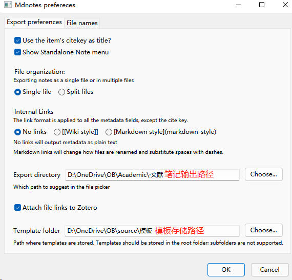
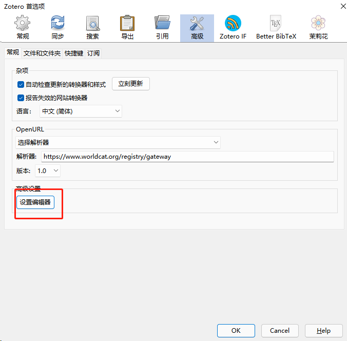
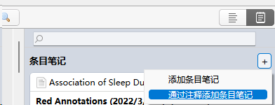
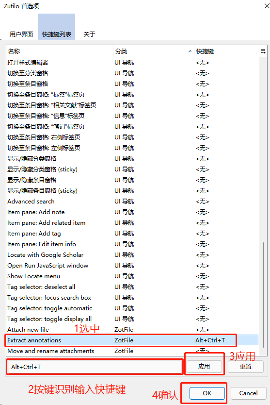
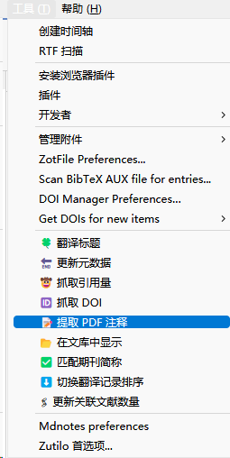

> **许可声明：本仓库及子文件采用GPL 3.0许可，请勿用于商业用途，如转载请遵守GPL 3.0许可协议**
>


***
> 前排致谢:

>  **感谢热心群友:*@小新没了蜡笔* 大佬 对于内置模板魔改进行的打磨与帮助!!!**

>  **感谢热心群友:*@墨砚宸* 大佬 对于 LogSeq 模板魔改进行的建议与推进!!!**

> 一些抱怨: 
> Gitee一直说我md文件内有不合规的，我查不出来，也懒得查就重启了这个GitHub镜像，虽然本来最开始也是在GitHub发布来着，不过大部分国内用户不是不好访问嘛。。。

# 前置设置

此处路径自定义，需下载对应软件模板文件并放在模板文件夹



## 模板

### OB模板
GitHub:
[OB Default](https://github.com/darkluna999/z6mdnojc/blob/master/OB/Mdnotes%20Default%20Template.md)
[OB Note](https://github.com/darkluna999/z6mdnojc/blob/master/OB/Zotero%20Note%20Template.md)
Gitee:
[OB Default](https://gitee.com/darkluna999/z6mdnojc/blob/master/OB/Mdnotes%20Default%20Template.md)
[OB Note](https://gitee.com/darkluna999/z6mdnojc/blob/master/OB/Zotero%20Note%20Template.md)

### Logseq模板
GitHub:
[Logseq Default](https://github.com/darkluna999/z6mdnojc/blob/master/Logseq/Mdnotes%20Default%20Template.md)
[Logseq Note](https://github.com/darkluna999/z6mdnojc/blob/master/Logseq/Zotero%20Note%20Template.md)
Gitee:
[Logseq Default](https://gitee.com/darkluna999/z6mdnojc/blob/master/Logseq/Mdnotes%20Default%20Template.md)
[Logseq Note](https://gitee.com/darkluna999/z6mdnojc/blob/master/Logseq/Zotero%20Note%20Template.md)

## 样式设置

- **(建议)** 开启设置编辑器-Zotero首选项 -> 高级 -> 设置编辑器

  
  
- **(不建议)** 或者 **Windows的资源管理器** 里访问 `%SystemDrive%\Users\%UserName%\AppData\Roaming\Zotero\Zotero\Profiles`这里不同设备会有 **不同的个人路径** 进入之后打开`prefs.js`文件进行编辑

### mdnote设置：通用

#### 变更条目：替换修改对应条目为修改后的值即可


| 条目                                          | 修改为                                                       | 修改前                                                       |
| --------------------------------------------- | ------------------------------------------------------------ | ------------------------------------------------------------ |
| extensions.mdnotes.placeholder.DOI            | `{"content":"{{field_contents}}", "field_contents": "{{content}}", "link_style": "no-links"}` | `{"content":"{{bullet}} DOI: {{field_contents}}", "field_contents": "{{content}}", "link_style": "no-links"}` |
| extensions.mdnotes.placeholder.citekey        | `{"content":"{{field_contents}}", "field_contents": "{{content}}", "link_style": "no-links"}` | `{"content":"{{bullet}} Cite key: {{field_contents}}", "field_contents": "{{content}}", "link_style": "no-links"}` |
| extensions.mdnotes.placeholder.cloudLibrary   | `{"content":"{{field_contents}}", "field_contents": "[Cloud library]({{content}})"}` | `{"content":"{{bullet}} {{field_contents}}", "field_contents": "[Cloud library]({{content}})"}` |
| extensions.mdnotes.placeholder.collections    | `{"content":"{{field_contents}}", "field_contents": "{{content}}", "link_style": "no-links", "list_separator": ", "}` | `{"content":"{{bullet}} Topics: {{field_contents}}", "field_contents": "{{content}}", "link_style": "wiki", "list_separator": ", "}` |
| extensions.mdnotes.placeholder.localLibrary   | `{"content":"{{field_contents}}", "field_contents": "[Local library]({{content}})"}` | `{"content":"{{bullet}} {{field_contents}}", "field_contents": "[Local library]({{content}})"}` |
| extensions.mdnotes.placeholder.notes          | `{"content":"# Notes", "field_contents": "{{content}}", "link_style": "no-links", "list_separator": "\n"}	` | `{"content":"## Highlights and Annotations\n\n- {{field_contents}}", "field_contents": "{{content}}", "link_style": "wiki", "list_separator": "\n- "}` |
| extensions.mdnotes.placeholder.pdfAttachments | `{"content":"## PDF Attachments\n- {{field_contents}}", "field_contents": "{{content}}", "list_separator": "\n- "}` | `{"content":"{{bullet}} PDF Attachments\n\t- {{field_contents}}", "field_contents": "{{content}}", "list_separator": "\n\t- "}` |
| extensions.mdnotes.placeholder.tags           | `{"content":"{{field_contents}}", "field_contents": "{{content}}", "link_style": "no-links", "list_separator": ", ", "remove_spaces": "true"}` | `{"content":"{{bullet}} Tags: {{field_contents}}", "field_contents": "#{{content}}", "link_style": "no-links", "list_separator": ", ", "remove_spaces": "true"}` |
| extensions.mdnotes.placeholder.title          | `{"content":"{{field_contents}}", "field_contents": "{{content}}", "link_style": "no-links"}` | `{"content":"# {{field_contents}}", "field_contents": "{{content}}", "link_style": "no-links"}` |
| extensions.mdnotes.html2md.default.bullet     |                                                              | `*`                                                          |


#### 添加条目：在设置板里右键-New，如下添加即可

| 条目                                               | 类型   | 键值                                                         |
| -------------------------------------------------- | ------ | ------------------------------------------------------------ |
| extensions.mdnotes.placeholder.shortTitle          | string | `{"content":"{{field_contents}}", "field_contents": "{{content}}", "link_style": "no-links"}` |
| extensions.mdnotes.placeholder.DOI                 | string | `{"content":"{{field_contents}}", "field_contents": "{{content}}", "link_style": "no-links"}` |
| extensions.mdnotes.placeholder.journalAbbreviation | string | `{"content":"{{field_contents}}", "field_contents": "{{content}}", "link_style": "no-links"}` |
| extensions.mdnotes.placeholder.publicationTitle    | string | `{"content":"{{field_contents}}", "field_contents": "{{content}}", "link_style": "no-links"}` |
| extensions.mdnotes.placeholder.callNumber          | string | `{"content":"{{field_contents}}", "field_contents": "{{content}}", "link_style": "no-links", "list_separator": ", ", "remove_spaces": "true"}` |
| extensions.mdnotes.placeholder.rights              | string | `{"content":"{{field_contents}}", "field_contents": "{{content}}", "link_style": "no-links"}` |

### OB 设置

#### zotfile（建议）

##### 变更条目：替换修改对应条目为修改后的值即可


| 条目                                                       | 修改为                                                                                                                                                                  | 修改前                                                                                               |
| ---------------------------------------------------------- | ----------------------------------------------------------------------------------------------------------------------------------------------------------------------- | ---------------------------------------------------------------------------------------------------- |
| extensions.zotfile.pdfExtraction.formatAnnotationNote      | `<p>&gt; %(content)</p><br>`                                                                                                                                            | `<p><i>%(content) (<a href="%(uri)">note on p.%(page)</a>)</i></p><br>`                              |
| extensions.zotfile.pdfExtraction.formatAnnotationHighlight | `<p>* "%(content)"<a href="%(uri)">p.%(page)</a></p>`                                                                                                                   | `<p>"%(content)" (%(cite))</p>`                                                                      |
| extensions.zotfile.pdfExtraction.formatNoteTitleColor      | `<p><h2><b>%(color)</b></h2></p><p></p><center><span style="opacity:0.5; SIZE:4"><font color=%(color)>◄◁◀≡≡≡≡≡≡≡≡≡≡≡≡≡≡▶▷►◈◄◁◀≡≡≡≡≡≡≡≡≡≡≡≡≡≡▶▷►</font></span></center>` | `<p><b>%(color) Annotations (%(date))</b></p>`                                                       |
| extensions.mdnotes.placeholder.author                      | `{"content":"> [!note]- ## Author\n> * {{field_contents}}", "link_style": "no-links", "list_separator": "\n> * "}`                                                      | `{"content":"{{bullet}} Authors: {{field_contents}}", "link_style": "wiki", "list_separator": ", "}` |
| extensions.zotfile.pdfExtraction.colorNotes                | `true`                                                                                                                                                                  | `false`                                                                                              |
| extensions.mdnotes.placeholder.related                     | `{"content":"> [!summary]- ## Related\n> * {{field_contents}}", "link_style": "wiki", "list_separator": "\n> * "}`                                                      | `{"content":"{{bullet}} Related: {{field_contents}}", "link_style": "wiki", "list_separator": ", "}` | 


#### zotero 原生提取

##### 变更条目：替换修改对应条目为修改后的值即可


| 条目                                                  | 修改为                                                       | 修改前                                                       |
| ----------------------------------------------------- | ------------------------------------------------------------ | ------------------------------------------------------------ |
| extensions.zotero.annotations.noteTemplates.title     | `<h2>({{date}}    {{title}})</h2>`                           | `<h1>{{title}}<br/>({{date}})</h1>`                          |
| extensions.zotero.annotations.noteTemplates.highlight | ```{{    if color == '#ff6666'}} <h3>⚔️悖论</h3><blockquote><p><span style="background-color: {{color}}80">{{highlight}}</p><p>📍引自：{{citation}}</p>{{if comment}}<p>✒️批注：{{comment}}</p >{{endif}}<p>🏷️标签: #{{tags join=' #'}}</p></blockquote>&emsp;  {{elseif color == '#a28ae5'}} <h3>📝生词</h3><blockquote><p><span style="background-color: {{color}}80">{{highlight}}</p><p>📍引自：{{citation}}</p>{{if comment}}<p>✒️批注：{{comment}}</p >{{endif}}<p>🏷️标签: #{{tags join=' #'}}</p></blockquote>&emsp;  {{elseif color == '#2ea8e5'}} <h3>🔬方法</h3><blockquote><p><span style="background-color: {{color}}80">{{highlight}}</p><p>📍引自：{{citation}}</p>{{if comment}}<p>✒️批注：{{comment}}</p >{{endif}}<p>🏷️标签: #{{tags join=' #'}}</p></blockquote>&emsp;  {{elseif color == '#ffd400'}} <h3>📒背景</h3><blockquote><p><span style="background-color: {{color}}80">{{highlight}}</p><p>📍引自：{{citation}}</p>{{if comment}}<p>✒️批注：{{comment}}</p >{{endif}}<p>🏷️标签: #{{tags join=' #'}}</p></blockquote>&emsp;  {{elseif color == '#5fb236'}} <h3>🔭前景</h3><blockquote><p><span style="background-color: {{color}}80">{{highlight}}</p><p>📍引自：{{citation}}</p>{{if comment}}<p>✒️批注：{{comment}}</p >{{endif}}<p>🏷️标签: #{{tags join=' #'}}</p></blockquote>&emsp; {{elseif color == '#ffe6a2'}} <h3>Xodo Yellow</h3><blockquote><p><span style="background-color: {{color}}80">{{highlight}}</p><p>📍引自：{{citation}}</p>{{if comment}}<p>✒️批注：{{comment}}</p >{{endif}}<p>🏷️标签: #{{tags join=' #'}}</p></blockquote>&emsp;{{elseif color == '#92e8e8'}} <h3>Xodo Cyan</h3><blockquote><p><span style="background-color: {{color}}80">{{highlight}}</p><p>📍引自：{{citation}}</p>{{if comment}}<p>✒️批注：{{comment}}</p >{{endif}}<p>🏷️标签: #{{tags join=' #'}}</p></blockquote>&emsp;{{elseif color == '#80e5b1'}} <h3>Xodo Green</h3><blockquote><p><span style="background-color: {{color}}80">{{highlight}}</p><p>📍引自：{{citation}}</p>{{if comment}}<p>✒️批注：{{comment}}</p >{{endif}}<p>🏷️标签: #{{tags join=' #'}}</p></blockquote>&emsp;{{elseif color == '#f1a099'}} <h3>Xodo Red</h3><blockquote><p><span style="background-color: {{color}}80">{{highlight}}</p><p>📍引自：{{citation}}</p>{{if comment}}<p>✒️批注：{{comment}}</p >{{endif}}<p>🏷️标签: #{{tags join=' #'}}</p></blockquote>&emsp;{{else }}<h3>颜色 --> {{color}} <-- 暂未添加在识别列表</h3><blockquote><p><span style="background-color: {{color}}80">{{highlight}}</p><p>📍引自：{{citation}}</p>{{if comment}}<p>✒️批注：{{comment}}</p >{{endif}}<p>🏷️标签: #{{tags join=' #'}}</p></blockquote><p>请参照<a href="https://gitee.com/darkluna999/z6mdnojc/blob/master/OB/obsidian添加外置颜色并生成键值.xlsx">gitee格式自行添加条目</a><a href="https://github.com/darkluna999/z6mdnojc/blob/master/OB/obsidian添加外置颜色并生成键值.xlsx">gitee格式自行添加条目</a>并进行替换</p><HR>{{endif}}``` | `<p></br>{{highlight quotes='true'}} {{citation}} {{comment}}</p>` |


### ob 显示设置

因为上述将很多键值输入到了yaml区域所以我们需要让他显示
obsidian 自带的yaml区metadata默认仅显示别名alias以及tag，很不方便
方案如下：

1. (不推荐)设置-编辑器-显示front-matter
2. (推荐)安装插件metatable，obsidian第三方市场有，但需要科学访问，如果不方便的话，B站UP-Johnny老师做了汇总-->[Airtable - OB社区插件汇总 - Johnny整理 - 每周更新 - B站 Johnny学](https://airtable.com/shrdmp10Lxmf5Wmgl/tblJqnWpcKURTjysX)

***

### <center><b>...下面是Logseq的设置...</b></center>

***

### Logseq 设置

#### zotero 原生提取（建议）

##### 变更条目：替换修改对应条目为修改后的值即可

| 条目                                                  | 修改为                                                       | 修改前                                                       |
| ----------------------------------------------------- | ------------------------------------------------------------ | ------------------------------------------------------------ |
| extensions.zotero.annotations.noteTemplates.title     | `<h2>({{date}}    {{title}})</h2>`                           | `<h1>{{title}}<br/>({{date}})</h1>`                          |
| extensions.zotero.annotations.noteTemplates.highlight | ```{{    if color == '#ff6666'}} <h3>⚔️悖论</h3><blockquote><p><span style="background-color: {{color}}80">{{highlight}}</p><p>&lt;p&gt;📍引自：{{citation}}&lt;/p&gt;</p>{{if comment}}<p>✒️批注：{{comment}}</p>{{endif}}<p>🏷️标签: #悖论 #{{tags join=' #'}}</p></blockquote>  {{elseif color == '#a28ae5'}} <h3>📝生词</h3><blockquote><p><span style="background-color: {{color}}80">{{highlight}}</p><p>&lt;p&gt;📍引自：{{citation}}&lt;/p&gt;</p>{{if comment}}<p>✒️批注：{{comment}}</p>{{endif}}<p>🏷️标签: #生词 #{{tags join=' #'}}</p></blockquote>  {{elseif color == '#2ea8e5'}} <h3>🔬方法</h3><blockquote><p><span style="background-color: {{color}}80">{{highlight}}</p><p>&lt;p&gt;📍引自：{{citation}}&lt;/p&gt;</p>{{if comment}}<p>✒️批注：{{comment}}</p>{{endif}}<p>🏷️标签: #方法 #{{tags join=' #'}}</p></blockquote>  {{elseif color == '#ffd400'}} <h3>📒背景</h3><blockquote><p><span style="background-color: {{color}}80">{{highlight}}</p><p>&lt;p&gt;📍引自：{{citation}}&lt;/p&gt;</p>{{if comment}}<p>✒️批注：{{comment}}</p>{{endif}}<p>🏷️标签: #背景 #{{tags join=' #'}}</p></blockquote>  {{elseif color == '#5fb236'}} <h3>🔭前景</h3><blockquote><p><span style="background-color: {{color}}80">{{highlight}}</p><p>&lt;p&gt;📍引自：{{citation}}&lt;/p&gt;</p>{{if comment}}<p>✒️批注：{{comment}}</p>{{endif}}<p>🏷️标签: #前景 #{{tags join=' #'}}</p></blockquote> {{else }} <h3>颜色 --> {{color}} <-- 暂未添加在识别列表</h3>                                              <blockquote><p><span style="background-color: {{color}}80">{{highlight}}</p><p>>&lt;p&gt;📍引自：{{citation}}&lt;/p&gt;</p>{{if comment}}<p>✒️批注：{{comment}}</p >{{endif}}<p>🏷️标签:#未知颜色 #{{tags join=' #'}}</p></blockquote> <p>请参照<a href="https://gitee.com/darkluna999/z6mdnojc/blob/master/Logseq/logseq添加外置颜色并生成键值.xlsx">gitee格式自行添加条目</a>并进行替换</p> <HR> {{endif}}``` |                                                              |
| extensions.mdnotes.placeholder.author                 | `{"content":"## Author\n* {{field_contents}}", "link_style": "no-links", "list_separator": "\n* "}` | `{"content":"{{bullet}} Authors: {{field_contents}}", "link_style": "wiki", "list_separator": ", "}` |
| extensions.mdnotes.placeholder.related        | `{"content":"## Related\n- {{field_contents}}", "link_style": "wiki", "list_separator": "\n-  "}` | `{"content":"{{bullet}} Related: {{field_contents}}", "link_style": "wiki", "list_separator": ", "}` |


#### zotfile

##### 变更条目：替换修改对应条目为修改后的值即可

| 条目                                                       | 修改为                                                       | 修改前                                                       |
| ---------------------------------------------------------- | ------------------------------------------------------------ | ------------------------------------------------------------ |
| extensions.zotfile.pdfExtraction.formatAnnotationNote      | `<p>&gt; %(content)</p><br>`                                 | `<p><i>%(content) (<a href="%(uri)">note on p.%(page)</a>)</i></p><br>` |
| extensions.zotfile.pdfExtraction.formatAnnotationHighlight | `<p>* "%(content)"<a href="%(uri)">p.%(page)</a></p>`        | `<p>"%(content)" (%(cite))</p>`                              |
| extensions.zotfile.pdfExtraction.formatNoteTitleColor      | `<p><h2><b>%(color) Annotations</b></h2></p>🏷️标签: #%(color)` | `<p><b>%(color) Annotations (%(date))</b></p>`               |
| extensions.zotfile.pdfExtraction.colorNotes                | `true`                                                       | `false`                                                      |


# 食用/使用步骤

## 基础使用

1. 批注: 方法并列
   * zotero6 6.0.4版本 内置阅读器编辑修改后：**文件 --> store Annotations**
     * 注意：Zotero6 6.0.5 及 beta 版本移除了 store Annotations 选项，目前解决方案如下：
       * Zoteo IF Pro Max 的 工具 --> 存储注释至 PDF 功能 (此功能需要通过: 编辑-首选项-IF设置-菜单-手动勾选 进行开启)
       * Zotero 自带的 File --> Save As 另存为 替换PDF文件 文件夹位置可通过右键条目-打开文件位置进行确定
   * 其他外部 PDF 阅读/编辑器中对 PDF 文件进行批注修改保存后保存到PDF
2. 提取: 方法并列
   *  (推荐)自带阅读器提取批注导出基于html语法[[zotero样式自定调节#zotero原生提取]]

      

   *  由于zotfile在zotero6隐藏了提取pdf批注生成annotation的选项，我们需要使用zotilo插件拉出这项功能：工具 --> zotilo首选项 --> 快捷键列表 --> extaract annotations zotfile设置快捷键，具体样式自定义详见[[zotero样式自定调节#zotfile]]

      

   *  IF Max Pro插件：工具 --> 提取pdf注释
      由于是调用zotfile提取pdf批注生成annotation，具体样式自定义详见[[zotero样式自定调节#zotfile]]

      


3. 文件输出: 批量选择需要导出的父条目-->右键父条目--> Mdnotes --> create full export note

## 食用方式-Extra (我的工作流)

在上面的流程之后呢就可以生成md文件

### Obsidian

可以直接输出到ob的库内，而后经过tag筛选/yaml筛选/dataview筛选/块引用进行原子化重组
GitHub:
[>>Zotero-OB 工作流](https://gitee.com/darkluna999/z6mdnojc/blob/master/OB/Zotero-OB%20工作流.md)
[>>内置提取后分色模板](https://gitee.com/darkluna999/z6mdnojc/blob/master/OB/内置提取后分色模板.md)
Gitee:
[>>Zotero-OB 工作流](https://gitee.com/darkluna999/z6mdnojc/blob/master/OB/Zotero-OB%20工作流.md)
[>>内置提取后分色模板](https://gitee.com/darkluna999/z6mdnojc/blob/master/OB/内置提取后分色模板.md)
### Logseq

因为不是很熟悉Logseq...我也不用就没有深挖，给一个大概的思路如下: 
可以直接输出到Logseq的page内，而后刷新数据库完成页面索引加载，经过标签或其他方式进行筛选/原子化重组

***
### 一些PS：

感谢你耐心读完这一堆不是人话的教程...

请，务必，不要抄漏了...

祝君，文运昌隆...

由于各种原因，教程后续或许不会再更新，但目前应已经足够了

> **xiaodl813** 注：由于 GitHub 不支持 base64 编码的图片，所以我简单的修改了一下 Markdown 源文件，把原本文件尾中的 base64 区域去掉，把图片放到了 `./img/` 文件夹下。